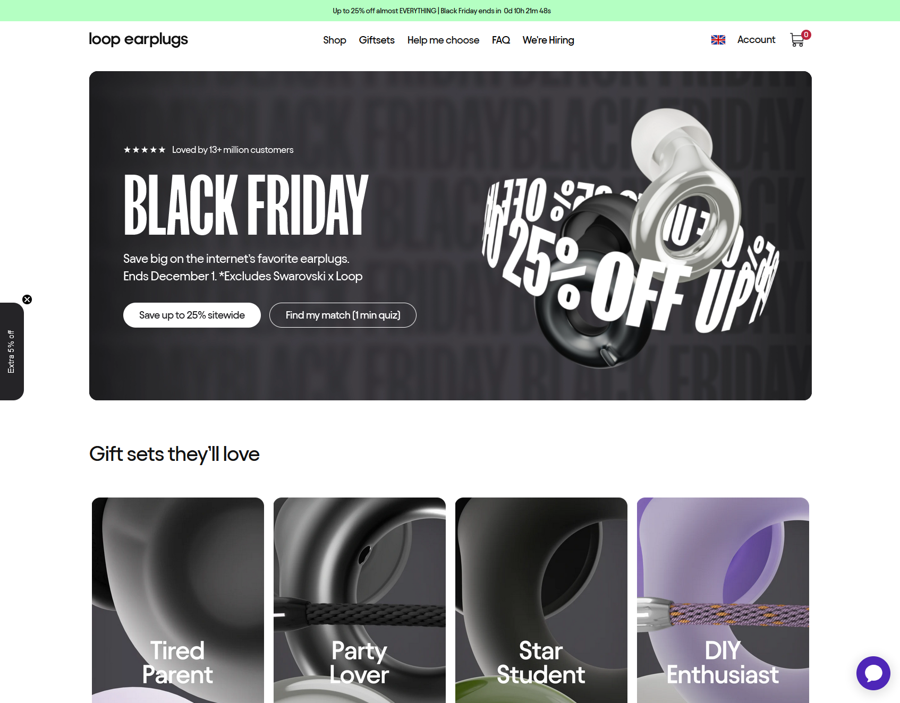

# IFA_1_Safeguarding

## 📋 Project Overview

A static website to give clear, easy-to-understand information on safeguarding practices, including how to recognize and respond to safeguarding concerns. Focus: simplicity, call to action, ease of information dissemination.

A project plan and outline:

-   Project workflow and repo setup
-   Creation of user stories
-   Wireframe skeleton and high priority features
-   development, smoke testing, deployment
-   in situe testing, performance and improvements

## Project Goals

This project aims to use a sleek and bold design to highlight only the most important information.

My target user group for this website are young adults. This will require a website that makes information approachable and reassuring, but does not belittle the user.

To do this, I will lean into bold and simplistic design language, that is widely present in media that targets this user group.
References and inspirations include:
https://talktofrank.com/

https://www.180studios.com/

https://www.loopearplugs.com/

## Solution Design Details

This will use bootstrap to make our 3 main sections responsive, with 2 cards grouped by background colour.
For desktops this will show as a 2x3 grid, and fold to a single 1x6 column on tablets and below.

Immediately following a the 'action steps' a CTA with an external redirect is presented, giving the user immediate help should they need. This remains at 100% width across all screens to keep this as proximal as possible.

Further information and additional resources are then presented, as this is less time sensitive than a user needing safeguarding assistance.

## Testing

## Deployment and workflow

This project is deployed through github pages and follows a simplified agile gitflow methodology. Main branch is preserved as the deployed and live branch, whilst all development work will be conducted on feature branches. Code deployments to the live project environment will only available through a pull request to main.
All feautures must be tested on the 'develop' branch before being considered a release candidate to main. This ensures the deployed project maintains a stable codebase, and provides a scaleable workflow should the project scope increase and more developers were required to join the project.

